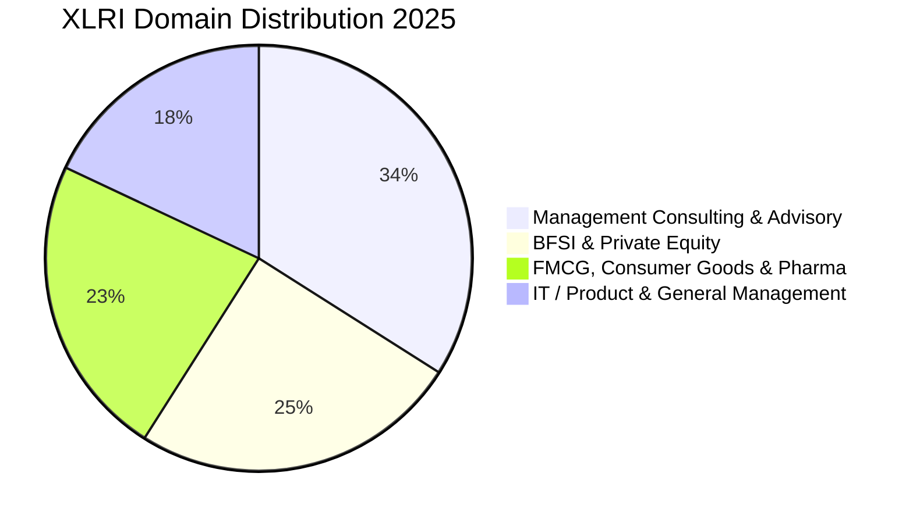

The **Xavier School of Management (XLRI)**, with campuses in **Jamshedpur** and **Delhi-NCR**, is India's oldest management institute and the undisputed #1 destination in Asia for Human Resource Management (HRM) and Business Management (BM).

The **2025 placement cycle** at XLRI maintained its legendary prestige, achieving **100% placements across both campuses** with an overall average CTC of **₹31.08 LPA** and a top international offer of **₹1.10 Crore per annum**.

Here is the complete **[XLRI Jamshedpur](/colleges/xlri-jamshedpur) & Delhi NCR Placement Report 2025**.

---

[InquiryCard title="Preparing for XAT 2026 or Targeting XLRI?" description="Get your XAT strategy, profile scoring, and decision-making prep mentored by Mohit Jain." cta="Get Free XAT Guidance" type="admission"]

---

## 1. XLRI Placement 2025: Key Highlights

| Metric | Combined Statistics (Jamshedpur & Delhi Campuses) |
| :--- | :--- |
| **Placement Success** | **100% Batch Placed (500+ Students)** |
| **Average CTC (Overall)** | **₹31.08 LPA** |
| **Median CTC** | **₹29.50 LPA** |
| **Highest International Package**| **₹1.10 Crore per annum** |
| **Highest Domestic Package** | **₹75.00 LPA** |
| **Top 25% Batch Average** | **₹38.50 LPA** |
| **Top 50% Batch Average** | **₹34.20 LPA** |
| **Total 2-Year Program Fees** | ₹28.00 – 29.50 Lakhs |

---

## 2. Program-Wise Comparison: BM vs HRM

*   **Business Management (PGDM-BM)**: Average CTC reached **₹32.40 LPA**, with dominant recruitment in Management Consulting, Investment Banking, and Tech Strategy.
*   **Human Resource Management (PGDM-HRM)**: Retained its global benchmark status with an average package of **₹29.80 LPA**, with top CHRO-track leadership roles from HUL, P&G, TAS, Microsoft, and ITC.

---

## 3. Sector & Recruiter Breakdown 2025

### Top Recruiters:
1. **Consulting (34%)**: McKinsey & Co., BCG, Bain & Co., Accenture Strategy, Kearney, Oliver Wyman, EY-Parthenon, PwC, Deloitte.
2. **BFSI & PE (25%)**: Goldman Sachs, JP Morgan Chase, Morgan Stanley, Avendus Capital, Barclays, Citibank, Standard Chartered.
3. **FMCG & Conglomerates (23%)**: Unilever (HUL), P&G, ITC, Nestlé, Mondelez, TAS (Tata Administrative Services), ABG, Godrej.
4. **Technology & Product (18%)**: Amazon, Microsoft, Google, Adobe, Flipkart, Uber, Media.net.

---

## 4. Related Placement Reports

*   **[SPJIMR Mumbai Placement Report 2025](/blog/spjimr-mumbai-pgdm-placement-report-2025)**
*   **[MDI Gurgaon Placement Report 2025](/blog/mdi-gurgaon-pgdm-placement-report-2025)**
*   **[BITSoM Mumbai Placement Report 2025](/blog/bitsom-mumbai-mba-placement-report-2025)**
*   **[All 21 IIMs Recent Placement Report 2025](/blog/all-iim-recent-placement-report-2025)**

---

### 🚀 Boost Your Preparation

Looking for more resources? **[Explore Our Premium MBA Mock Test Series 2026](/mock-tests)** to get real-time exam experience and detailed performance analytics.

---
